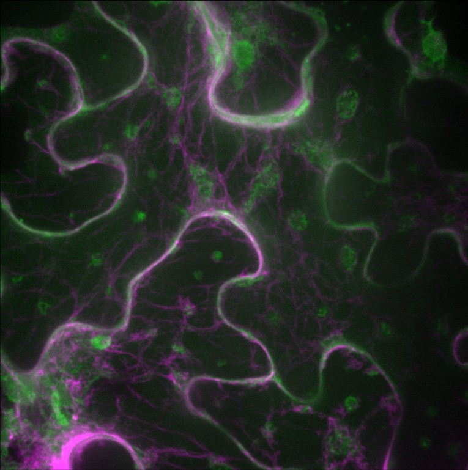

```{r setup, include=FALSE}
knitr::opts_chunk$set(echo = TRUE)
library(tidyverse)
library(ape)
library(msa)
library(phangorn)
library(rentrez)
library(seqinr)
library(ggmsa)
library(Biostrings)
library(DECIPHER)
library(ggtree)
library(plotly)
```

[Return to Homepage](../index.html)

# The inspiration for this project #

## My good friends from Purdue ## 

2024 Plant Biology and Data Science (PURE-PD)^[Lizzie, Dialo, and Jeremy pictured]

```{r,out.width="75%", echo=FALSE}

```


I spent the Summer of 2024 in a small town in Indiana killing plants. I worked at Purdue University (Go Boilermakers!) in the plant pathology department. There, I had the pleasure of working in Dr. Anjali Iyer-Pascuzzi's Lab with my mentor, Abbie^[Shout out to Abbie for being the best mentor ever]. Her lab specializes in characterizing and analyzing _Ralstonia solanacearum_ which is a pathogenic bacterium that causes damage to potatoes, tomatoes, and geraniums. I learned how to do colonization assays, plant infiltrations, and ROS assays to determine how certain effectors within _Ralstonia_ work. Effectors are proteins that are injected into a host organism to create more favorable colonization conditions^[Effectors can come in all shapes and sizes, but my project will mostly investigate Type 3 ones]. My interest in effectors did not end when I returned to Utah.

## My lab ##

```{r, out.width="75%", echo=FALSE}

knitr::include_graphics("./IMG_6962.jpeg")

```


The best part about _Ralstonia_ is that, in certain media, it has a Barbie Pink color:

```{r, out.width="75%", echo=FALSE}


```

With all that sentimental stuff done, here is the project:

# The Project #


There are A LOT of different effectors within _Ralstonia solanacearum_. This led me to wonder how they could be connected and how they have evolved in different strains of this bacterium.

## The tale of no good, very bad spreadsheets ##

After many hours of looking for a good data set, I thought I found one. I was wrong. I found a useful table from Plant-Host Interactions (PHI-base). This database collects different effectors from many pathogens. While this is a cool data set, I soon realized that many of the genes are mislabeled, there is A TON of missing data for _Ralstonia_, and I was not going to get very far with it ^[I probably should have stopped after some questionable cleaning]. This is where I realized I would need a new data set.

That data set was not completely useless, so here are some interesting connections from information about _Ralstonia_ from PHI-base.

```{r, echo=FALSE}

raldat <- read_csv("raldat.csv")

raldat %>%
  ggplot(aes(x=Experimental_host_species, fill=Experimental_strain)) + geom_bar() + theme_minimal() + scale_fill_viridis_d(option="A") + labs( x="Plant species",
                                                                                                                                               y="Relative amount of plants infected by Ralstonia strains") + theme(axis.text.x = element_text(angle=90, size=7))

```
Ok as you can see the information from there was not entirely helpful to my project as there weren't that many strains of _Ralstonia solanacearum_ recorded. And the effectors were mislabeled and often duplicated.^[Ok I'll stop complaining]

## Back to business ##

I started work with another data set that contained many Rip (Ralstonia injected proteins) types and strain variants. ^[New data set from this really cool paper: "Repertoire, unified nomenclature and evolution of the Type III effector gene set in the Ralstonia solanacearum species complex" by Nemo Peeters et al.] Here is a table to look through them:^[Feel free to click through all 63 pages]


```{r, echo=FALSE}
library(reactable)

reactable(read_csv("clean_effect.csv"))
```

After getting this data, I had to pull the protein sequences from NCBI's GenBank. The only problem, there are 622 sequences. No matter how much I believe in my laptop, it won't survive that request.

## Downloading the protein sequences ##

So, I had to do it in batches:^[Shoutout to many internet searches on how to get this to work and generative AI]

```{r, eval=FALSE}
library(rentrez)
library(seqinr)
#getting only the accession numbers
ral_dfaccession <- ral_df$accession
#getting sequences
ids <- ral_dfaccession
# split into batches of 20 (all my computer can handle)
batch_size <- 20
id_batches <- split(ids, ceiling(seq_along(ids) / batch_size))
all_seqs <- list()
for (i in seq_along(id_batches)) {
  cat("Downloading batch", i, "\n")
  #FASTA sequences
  fasta <- entrez_fetch(db="protein", id=id_batches[[i]], rettype="fasta", retmode="text")
  # FASTA into individual sequences
  temp <- tempfile()
  writeLines(fasta, temp)
  seqs <- read.fasta(temp, seqtype="AA", as.string=TRUE)
  all_seqs <- c(all_seqs, seqs)
}
```

These FASTA sequences were saved. Next, their names had to be changed.^[A cruel punishment to make me rename everything]
For those out there who must suffer as I did, here is the code for that:
```{r, eval=FALSE}
#renaming so not accession numbers
sequences <- read.FASTA("ralproteins.fasta", type="AA")
#accession numbers as sequence names
names_df <- data.frame(accession = names(sequences))
#merge tables to find where differences and get rid of different ones
merged_df <- merge(names_df, ral_df, by = "accession", all.x = TRUE)
merged_df$fullname <- paste(merged_df$name, merged_df$`#Species`)
# renamed sequences
names(sequences) <- merged_df$fullname
#saved the renamed sequences
write.fasta(sequences, names = names(sequences), file.out = "ral_fullname.fasta")
```
At last, we can move on.^[Most of these were NOT problems I thought about. Consider this in the future]

## Aligning sequences ##
Following this, the sequences have to be aligned. There are a couple different options, but after doing some research I think I will use the msa package as it is efficient and maybe won't melt my computer.

I will need to break up the Rip proteins quite a bit to get my computer to run anything.^[I am writing this after many hours of troubleshooting due to file size]

Here is an small preview of an alignment for the RipU proteins from different species:^[Labels for sequences are missing because they simply did not fit, my bad]

```{r, echo=FALSE, message=FALSE, warning=FALSE}
sequences <- readAAStringSet("ral_renamed.fasta")
subset_sequences <- sequences[grep("RipU", names(sequences))]

ggmsa(subset_sequences, start=50, end= 100, color = "Clustal", 
      font = "helvetical", char_width = 0.5 )
```

In starting the alignment, different proteins need to be compared across the different strains of _Ralstonia_. The msa package was used here with the alignment type= "Muscle". This was used, not only because it has a cool name, but also because it was said to be good for accurate sequence alignment, even when the sequences are short. ^[As is the case with most effectors.]


## Building the tree ##

For RipU, here is a small tree to show the connections of this effector within different bacterial strains. ^[RipU is close to my heart since I worked with it so much]

```{r, echo=FALSE, message=FALSE, warning=FALSE}
#for RipU
sequences <- readAAStringSet("ral_fullname.fasta")
#keep sequences with "ripU"
subset_sequences <- sequences[grep("ripU", names(sequences))]
#align 
alignRipU <- AlignSeqs(subset_sequences)
#tree
DRipU <- DistanceMatrix(subset_sequences, correction="none", # choose a model
                        type="dist",
                        processors=NULL) # use all CPUs )
tree_ripU <- Treeline(myDistMatrix=DRipU,
                      method="ME",
                      showPlot=FALSE,
                      processors=NULL)
ggtree(tree_ripU)+ geom_tiplab(size = 5) + geom_treescale()
```

Now let's make this better. Here is another chart with all of the "ripA" effectors. These effectors serve multiple purposes in suppressing transcription factors, altering pathways, and destroys the structure of microtubules.

```{r, message=FALSE, warning=FALSE}
#for all effectors
sequences_all <- readAAStringSet("ral_fullnamereal.fasta")
subset_sequencesripA <- sequences_all[grep("ripA", names(sequences_all))]


#aligning
alignRipA <- AlignSeqs(subset_sequencesripA)
#tree
allripA <- DistanceMatrix(subset_sequencesripA, correction="none", # choose a model
                        type="dist",
                        processors=NULL) # use all CPUs )
tree_rips <- Treeline(myDistMatrix=allripA,
                      method="ME",
                      showPlot=FALSE,
                      processors=NULL)
interactivetreeA <- ggtree(tree_rips)+ geom_tiplab() 
#fun tree for people who like to click on things
ggplotly(interactivetreeA) %>% plotly::add_text(data = interactivetreeA$data,  x = ~x,  y = ~y,  text = ~label,  textposition = 'right', size=1)

```

## Some very vague conclusions ##

_Ralstonia solanacearum_ is found on all continents. As crops move, this bacteria has the potential to spread throughout and diversify. Some strains are event becoming cold resistant and they are able to survive in new climates. Building a  phylogenetic tree allows us to investigate where strains are evolving from and how they can be prevented from moving forward.

## If I could do this again ##
I would not melt my computer trying to make a really big tree even though it would've been really cool.

```{r,echo=FALSE}

```

[Return to Homepage](../index.html)


