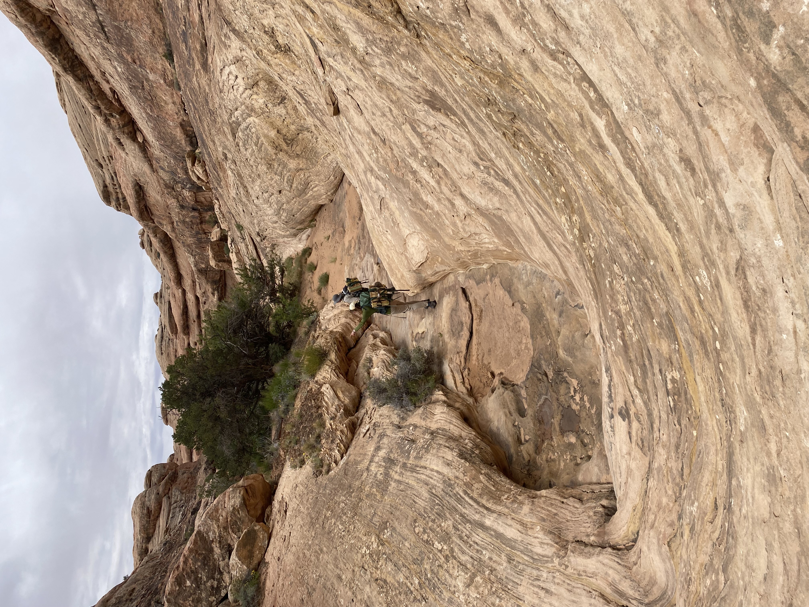
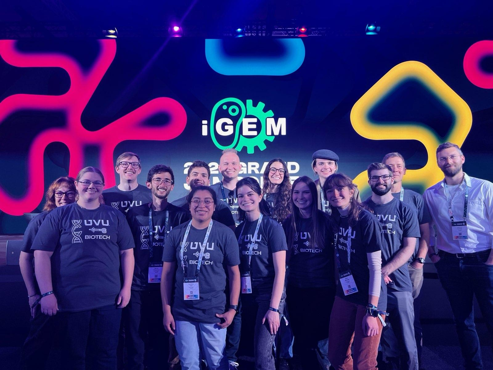
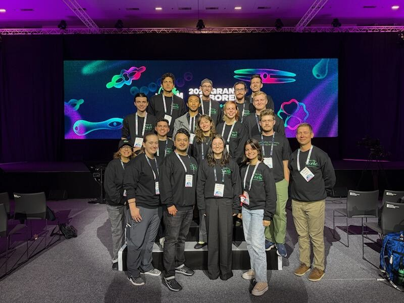
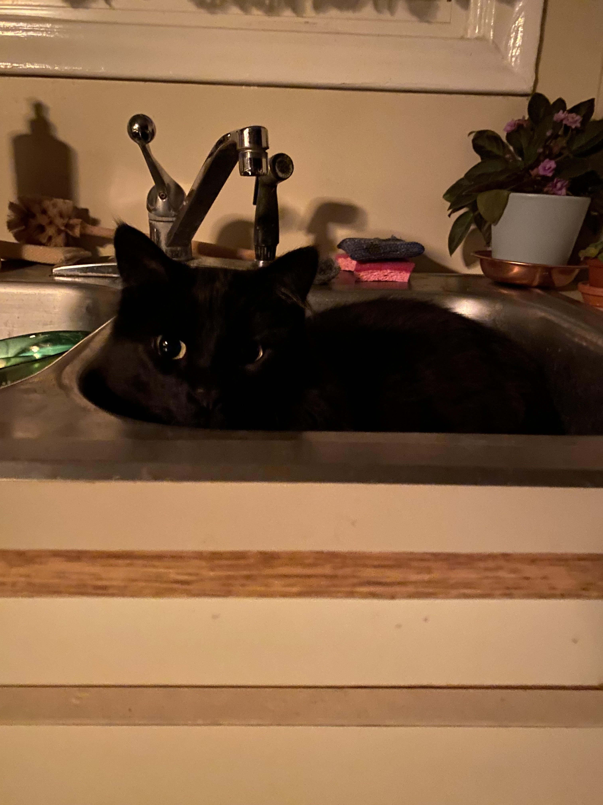

```{r setup, include=FALSE}
knitr::opts_chunk$set(echo = TRUE)
library(tidyverse)
```

[Return to Homepage](../index.html) 

# An Introduction #

Graduating soon with a degree in biotechnology from Utah Valley University. During my time at UVU, I have participated in multiple research groups and attended many conferences. I've done cool research and met some amazing people.

## Dr. Laney's Virology Lab ##

I love killing plants. I have worked with Dr. Laney for 3 years on Beet Curly Top Virus in novel hosts. We've been backpacking in the desert, combing through farms, and labeling thousands of tubes. We have tons of samples to still work through. 

```{r, out.width="75%", echo=FALSE}

```
Last year, we were able to publish a paper that described some of the new hosts that we found for BCTV within the state. We plan to continue research throughout the summer and push a few more papers before I go to grad school.


## iGEM: Dr. Hough and Dr. Domyan's Lab ##

I am the school's number one enemy for using money. I have been to Paris twice for the iGEM competition. I have been on the team for 2 years and I continued research on the project well after the competition was finished. 


```{r, out.width="75%", echo=FALSE}
knitr::include_graphics("../pics/paris.jpeg")
```


This project involves the use of a genetically modified algae to reduce excess nutrients that flow into Utah Lake. The gene known as "nosZ" converts nitrous oxide to nitrogen gas which is harmless to the atmosphere. In contrast, nitrous oxide is a potent greenhouse gas.

Here is the first iGEM team from Fall 2023:

```{r, out.width="75%", echo=FALSE}

```

And the second one in Fall 2024:


```{r, out.width="75%", echo=FALSE}

```


## Future plans ##

Within the next year, I plan to apply to graduate school on the West Coast. I want to get a PhD (so scary to say) in synthetic biology with a focus on environmental remediation through genetically modified organisms. 

## Picture of my cat for making it this far ##

```{r, out.width="75%", echo=FALSE}

```


[Return to Homepage](../index.html) 


